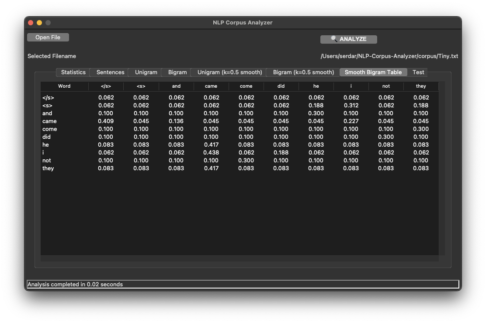
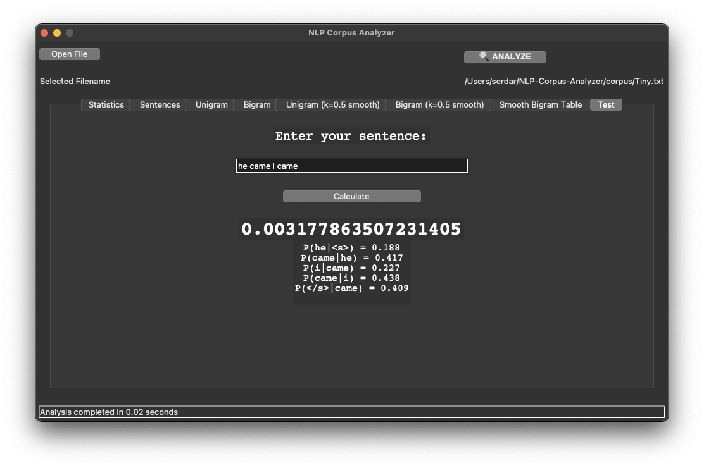

      

  
<h3 align="center">NLP Corpus Analyzer</h3>

  

    A simple corpus analyzer written with Python and Tkinter.
     
    <a href="https://github.com/Mavrikant/NLP-Corpus-Analyzer"><strong>Explore the docs »</strong></a>
     
     
    <a href="https://github.com/Mavrikant/NLP-Corpus-Analyzer">View Demo</a>
    ·
    <a href="https://github.com/Mavrikant/NLP-Corpus-Analyzer/issues">Report Bug</a>
    ·
    <a href="https://github.com/Mavrikant/NLP-Corpus-Analyzer/issues">Request Feature</a>
  

## About The Project

This is a simple program written with Python to analyze text files. It seperates text to sentences using NLTK, finds Unigram, Bigrams and calculates their probabilities. With the "test" tab of the program, you can probability of that sentence with Bigram model.   

### Built With

* [Python](https://www.python.org/)
* [NLTK](https://www.nltk.org/)
* [tkinter](https://docs.python.org/3/library/tkinter.html)

## Contributing

Contributions are what make the open source community such an amazing place to learn, inspire, and create. Any contributions you make are **greatly appreciated**.

If you have a suggestion that would make this better, please fork the repo and create a pull request. You can also simply open an issue with the tag "enhancement".
Don't forget to give the project a star! Thanks again!

## Contact

M. Serdar Karaman - m.serdar.karaman@gmail.com

Project Link: [https://github.com/Mavrikant/NLP-Corpus-Analyzer](https://github.com/Mavrikant/NLP-Corpus-Analyzer)

## License

[MIT](https://choosealicense.com/licenses/mit/)
